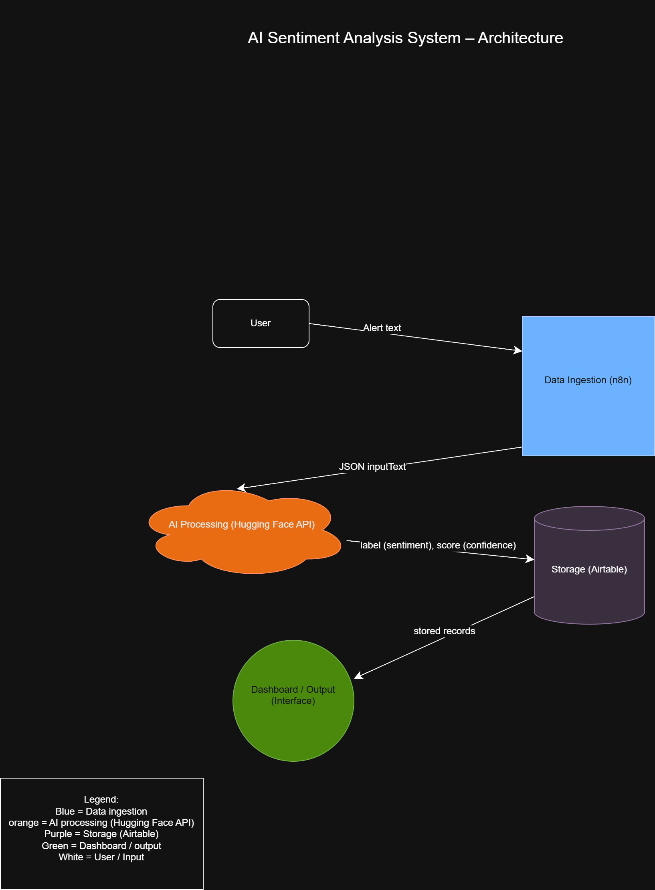

# AI Threat Intelligence Feed Dashboard

## 📌 Project Overview
Cybersecurity teams are overwhelmed by the volume of threat intelligence published daily across blogs, CVE databases, and public threat feeds. This project automates the collection, summarization, and prioritization of threat data so analysts can focus on the most relevant threats instead of manually reviewing everything.

---

## ❗ Problem Statement
Security analysts spend too much time manually reading and organizing threat data from different sources. This slows down response time and increases the risk of missing important threats. This system solves that by automatically collecting, analyzing, and prioritizing threat intelligence.

---

## 👥 Target Users
- Security analysts  
- IT administrators  
- Small-to-mid-size organizations  

These users need fast and organized threat insights without manually monitoring multiple sources.

---

## 🏗️ Architecture Diagram
See the system architecture below:

---

## ⚙️ Component Breakdown

### 1. Feed Collector (n8n)
- Collects threat data from RSS feeds and CVE databases  
- Normalizes data and stores in Airtable  

### 2. AI Processing (Hugging Face / Groq)
- Performs sentiment analysis / classification  
- Extracts important information (label + confidence score)  

### 3. Storage (Airtable)
- Stores processed threat data  
- Includes sentiment and confidence  

### 4. Dashboard / Interface
- Displays processed results  
- Allows users to view prioritized threats  

---

## 📊 Data Sources
- RSS feeds (security blogs)  
- CVE databases (NVD)  
- Public threat intelligence feeds  

---

## 🤖 AI Capabilities
- Text classification (sentiment / threat type)  
- Confidence scoring  
- (Optional) summarization or extraction  

---

## 📈 Success Metrics
- System successfully processes incoming threat data  
- AI correctly classifies sentiment  
- Data is stored and displayed without errors  
- End-to-end workflow runs automatically  
- Dashboard shows organized threat results  

---

## 🔗 GitHub Repository
https://github.com/Barry-Dinka/ai-capstone-threat-intelligence-feed-dashboard

---

## 🛠️ Tools Used
- n8n  
- Hugging Face API  
- Airtable  
- draw.io  

---

## 🚀 Status
Project setup and architecture completed. Workflow implementation in progress.
